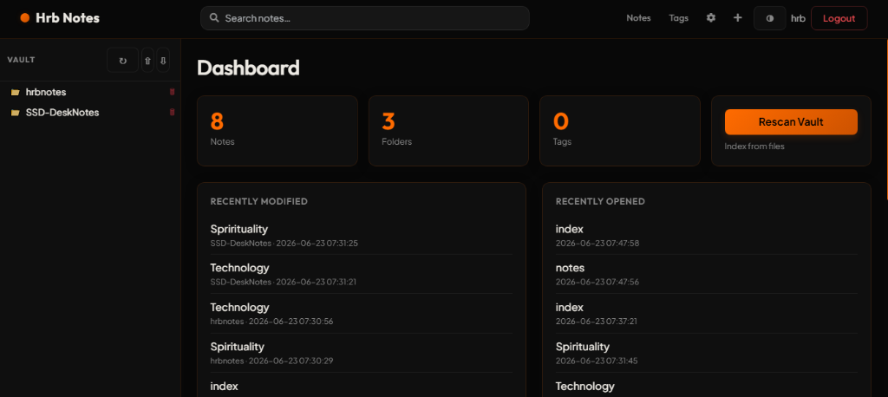

# Hrb Notes

An Obsidian-compatible web application for browsing, editing, and searching your Markdown vault online. Built to run on plain **shared hosting / cPanel** — no SSH, no Docker, no Node.js, no Composer. Just **PHP 8.1+ and SQLite**.

---

### Project Metadata
* **Author**: Hrb Ranjan
* **WhatsApp**: [+8801979189844](https://wa.me/8801979189844)
* **GitHub Project**: Hrb Notes

---

## Table of Contents
1. [User Tutorial](#user-tutorial)
2. [Deployment Notes](#deployment-notes)
3. [PKH Vault Sync Agent Guide](#pkh-vault-sync-agent-guide)
4. [Important Warnings & Backups](#important-warnings--backups)
5. [Author & Support](#author--support)

---

## User Tutorial

Hrb Notes is designed to make managing your Markdown notes online as seamless and Obsidian-compatible as possible. Here is a walkthrough of how to use the web application:

### 1. The Dashboard
When you log in, you are greeted by the dashboard, which presents:
* **Vault Statistics**: A high-level count of total notes, folders, and unique tags currently recognized in your vault.
* **Recently Modified**: A quick list of notes you or the sync agent have updated recently.
* **Recently Opened**: Notes you have viewed in this browser session.

### 2. Vault Sidebar Browser
* Located on the left, the vault sidebar displays your files and folders in a clean nested structure.
* Click folders to expand/collapse them.
* Click any note to load it instantly inside the main viewer area.
* **Responsive Control**: You can toggle the sidebar open or closed using the panel button (`☰`) in the top actions bar. On mobile, the sidebar collapses automatically to maximize reading space.

### 3. Reading and Navigating Notes
* **Wiki Links**: Links formatted as `[[Note Name]]` or `[[Note Name|Custom Label]]` are parsed automatically. If the note exists, clicking it loads that note instantly. If it doesn't exist, it opens a global search for that term.
* **#Tags**: Inline tags (e.g., `#project/task-1` or `#ideas`) are linkified. Clicking a tag opens all notes sharing that tag.
* **Metadata Rail (Right Side)**: When viewing a note on desktop, you will see a right-hand rail containing:
  * **Tags**: All tags found in the current note.
  * **Backlinks**: A list of other notes that link directly to the current note.
  * **Outgoing Links**: A list of notes referenced inside the current note.
  * **Info**: File location/folder and the last modified timestamp.

### 4. Editing Notes
* Click the **Pencil Icon** (Edit) in the note toolbar to switch to editing mode.
* The application loads **EasyMDE**, a premium, feature-rich Markdown editor.
* **Markdown Toolbar**: Customize formatting easily (Bold, Italic, Headers, Lists, Quotes, Code Blocks, Tables, Links, and Preview).
* **Autosave**: The editor automatically saves a local draft draft backup to the server every **30 seconds** to protect your work from browser crashes or network disconnects.
* **Renaming Notes**: While in edit mode, you can edit the path/name of the note directly in the breadcrumb input field (e.g., changing `notes/my-note.md` to `archive/my-note.md`). Saving the note will automatically move/rename the physical file on the server and update your links.
* **Conflict Prevention**: If someone else updates a note while you are editing it, the app detects the conflict (using file modification times) and prompts you to review changes rather than blindly overwriting them.

### 5. Uploading Images & Files
* While editing, you can upload media directly into your vault by clicking the **Image Icon** in the Markdown toolbar.
* Select any supported file type (`.png`, `.jpg`, `.jpeg`, `.gif`, `.webp`, `.svg`, `.pdf`, `.zip`).
* The file is uploaded to the server's `/uploads` folder, and the corresponding Markdown code (e.g., ``) is instantly inserted at your editor cursor.
* The upload status is displayed next to the editor toolbar.

---

## Deployment Notes

Hrb Notes is optimized for shared hosting servers (such as cPanel) running **PHP 8.1+** with the **pdo_sqlite** and **mbstring** extensions enabled.

### Option A: Document Root pointed at `/public` (Recommended)
This is the most secure setup because it keeps your application core files outside of the public directory.
1. **Upload Files**: Extract the project files to a folder above `public_html` (e.g., `/home/username/notes-app/`).
2. **Point Domain**: Configure your domain or subdomain's Document Root to point directly to the `/public` folder of your project (e.g., `/home/username/notes-app/public`).
3. **Set Permissions**: Ensure the following directories are writable by PHP:
   * `/storage` (holds the SQLite database file)
   * `/vault` (holds your Markdown notes)
   * `/uploads` (holds uploaded files)
4. **Install**: Go to `https://yourdomain.com/install.php` in your browser, complete the setup form, and **delete `public/install.php`** immediately afterwards.

### Option B: Everything inside `public_html`
Use this option if your host does not allow pointing domains to subdirectories.
1. **Upload Files**: Upload the entire project directory directly into `public_html`.
2. **htaccess Protection**: Direct access to `/app`, `/config`, and `/storage` is blocked by the root `.htaccess` and folder-level `.htaccess` configurations.
3. **Install**: Go to `https://yourdomain.com/install.php`, complete the setup form, and **delete `public/install.php`** immediately.

---

## Vault Sync Agent Guide

The **Vault Sync Agent** is a standalone companion application built to automatically synchronize your local PC's Obsidian vault folder with your online hosted Hrb Notes website.

### Features
* **Two-Way Sync**: Uploads local note changes to the web app, and downloads new/edited notes from the server back to your computer.
* **Conflict Resolution**: If a note has been modified on both your local PC and the server since the last sync cycle, the agent renames the files (creating `NoteV1local.md` and `NoteV1web.md` side-by-side) so that you do not lose any edits.
* **Local Recycle Bin**: If a note is deleted on the server, instead of deleting the local file permanently, the agent moves it to a local folder named `Recycle Bin` in the root of your local vault folder. This prevents accidental deletion of your notes.
* **Background Operation**: Can be run automatically on Windows startup and minimized to the system tray/background to run silently at custom intervals.

### Setup and Usage
1. Locate the standalone executable [Vault_Sync_Agent.exe](file:///C:/Users/bhans/Downloads/NoteMaster/sync_agent/dist/Vault_Sync_Agent.exe) (located in the `sync_agent/dist/` directory).
2. Launch the application.
3. **Configure the Connection Settings**:
   * **Site URL**: The full web URL of your hosted Hrb Notes installation (e.g. `https://notes.yourdomain.com`).
   * **Target Vault Name**: The vault name you set up on your server.
   * **Vault Folder**: Click the **Browse...** button to select the local directory on your PC that contains your notes (e.g. your local Obsidian vault).
   * **Admin ID & Password**: Your Hrb Notes web login credentials.
   * **Interval**: The frequency (in minutes) at which the agent checks for changes in the background.
   * **Startup option**: Check "Run automatically on Windows startup" if you want the agent to auto-start.
4. **Initiate Sync**:
   * Click **Save & Start Sync** to enable the automated background sync loop.
   * Click **Sync Now** to trigger an immediate, manual synchronization.

---

## Important Warnings & Backups

> [!WARNING]
> ### CRITICAL DATA LOSS WARNING & BACKUP NOTICE
> * **Backup Outside the Sync Folder**: Always make a complete backup copy of your local Markdown notes and media files to a completely separate folder (e.g., a backup folder on your desktop, external drive, or cloud storage) **before** configuring or starting the Vault Sync Agent for the first time.
> * **Risk of Data Loss**: Incorrect configuration of the Site URL, credentials, vault name, or local vault directory path inside the Sync Agent UI could cause the agent to interpret files incorrectly. This can result in accidental deletions or overwriting of your local files during synchronization.
> * **Configuration Verification**: Double-check all connection details and paths inside the Sync Agent UI before saving or running the sync.
> * **Periodic Backups**: Continue to make regular manual or automated backups of your vault folders. The authors and project contributors are not responsible for any data loss.

---

## Author & Support

If you run into issues, need custom development, or want to contribute to the project, please get in touch:

* **Author**: Hrb Ranjan
* **WhatsApp**: [+8801979189844](https://wa.me/8801979189844)
* **GitHub Project**: Hrb Notes
